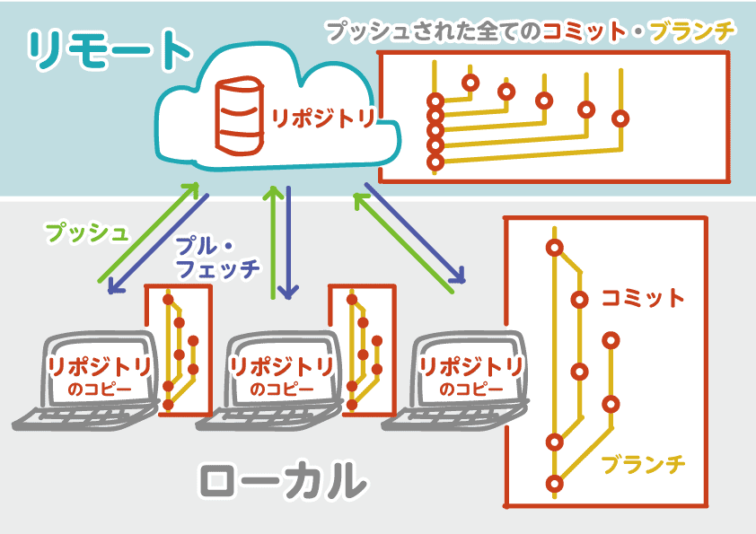

# 共有会のレジメ

## はじめに

### 目的

- Gitについて知る
- 作業フローを再認識して理解する
- 不具合が出たときの対応を

### Gitとは

バージョン管理ツールです

### 比較しない

SVNと比較しないでください
２つは同じ「バージョン管理ツール」です
共通するところはありますが、そもそも概念が違うので似て非なるものです
なのでSVNの概念と共通して考えると混乱します
ここではSVNのことは忘れてください

### Gitざっくり図解

### Git用語

| 用語 | 説明 | `名称` or `フロー` |
| --- | --- | :-: |
| **リポジトリ** | 履歴管理を行う対象。  また、管理対象を含む全てのデータまとまった場所。 | `名称` |
| **リモートリポジトリ** | サーバーにあるリポジトリ リモートと略す。 | `名称` |
| **ローカルリポジトリ** | 自分のPCにあるリポジトリ。 ローカルと略す。 | `名称` |
| **クローン** | リモートリポジトリをコピーしてローカルリポジトリを作成すること。 | `フロー` |
| **ワークツリー** | 履歴管理を行いたいファイルがある場所。 | `名称` |
| **インデックス** | コミットしたいファイルを登録する場所。 | `名称` |
| **ステージ** | ワークツリーからコミットしたいファイルをインデックスに登録すること。 | `フロー` |
| **コミット** | インデックスに登録してある変更をローカルリポジトリに反映すること。 | `フロー` |
| **リセット** | コミット前の変更を戻すこと。 また、特定のコミットまで状態を戻すこと。 ただし、ローカルリポジトリに限られる。 | `フロー` |
| **プッシュ** | ローカルリポジトリの変更をリモートリポジトリに反映させること。 | `フロー` |
| **プル** | リモートリポジトリの変更をローカルリポジトリに反映させること。 | `フロー` |
| **フェッチ** | リモートリポジトリの変更（コミット情報）をローカルリポジトリに反映させること。 ファイルの変更は行わない。 | `フロー` |
| **コンフリクト（競合）** | マージ対象の２ファイルで同じ箇所が変更されており、自動でマージができないこと。 手作業で解決する必要がある。 | `名称` |
| **ブランチ** | 履歴管理を枝分かれさせてたもの。 ブランチを使うこちにより、複数の履歴を並列に管理できる。 | `名称` |
| **チェックアウト** | ブランチを切り替えること。 | `フロー` |

> 引用
>#  [Git 基本の用語集 - Qiita](https://qiita.com/toshi_um/items/72c9d929a600323b2e77)

## Gitを使用する目的

- バージョン管理を最適化するため
- 複数人での作業を最適化するため
-#  複数課題の作業を同時進行で管理するため

## まとめ

- Gitフローを必ず守る
- フロー以外のことが発生したら必ず確認する
- コンフリクト解決は必ずわかる人に聞く
- 解決した内容はナレッジとしてDocBaseに追記する

---